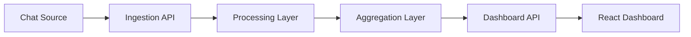

# Chat Analyser

Chat Analyser is a real-time moderation analytics tool for live chat. It ingests chat messages, normalises noisy text, groups repeated or similar messages, and surfaces live signals in a dashboard for moderators and streamers.

## Features

- ingest structured chat messages with `username` and `body`
- normalise Unicode text and common typo patterns
- group repeated messages into simple spam clusters
- extract frequently discussed terms as lightweight topics
- display message velocity, topic activity, and recent processed chat

## Architecture



### Pipeline

1. The backend receives a chat message.
2. The message is normalised:
   - lowercased
   - Unicode normalised
   - repeated punctuation reduced
   - common typo variants corrected
3. A cluster key is generated from the normalised text.
4. The system updates aggregate state:
   - recent message count
   - active users
   - likely spam clusters
   - top topic terms
5. The frontend polls the summary endpoint and renders the latest state.

## Tech stack

- FastAPI
- Pydantic
- React
- Vite

## Project structure

```text
backend/
  app/
    aggregation.py
    main.py
    models.py
    normalisation.py
    sample_data.py
  requirements.txt
frontend/
  src/
    App.jsx
    main.jsx
    styles.css
  index.html
  package.json
  vite.config.js
```

## Run locally

### Backend

```bash
cd backend
python3 -m venv .venv
source .venv/bin/activate
pip install -r requirements.txt
uvicorn app.main:app --reload
```

Backend: `http://localhost:8000`

### Frontend

```bash
cd frontend
npm install
npm run dev
```

Frontend: `http://localhost:5173`

## API

### `GET /health`

Simple health check.

### `GET /api/summary`

Returns the current dashboard summary.

### `POST /api/messages`

Accepts a single chat message:

```json
{
  "username": "demo_user",
  "body": "thsi game sux!!!"
}
```

### `POST /api/simulate?count=15`

Loads sample chat messages into the pipeline for testing the dashboard..
